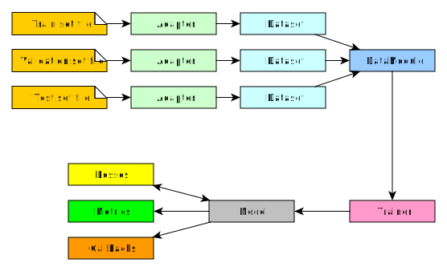

# transformers-lightning

A collection of `adapters`, `datasets`, `datamodules`, `callbacks`, `models`, `metrics` and `losses` to better intergrate the [PyTorch Lightning](https://pytorch-lightning.readthedocs.io/en/stable/lightning-module.html) and the [Transformers](https://huggingface.co/transformers/) libraries.


# Table of contents
**[1. Install](#install)**

**[2. Documentation](#doc)**

  * [2.1. Adapters](transformers_lightning/adapters)
  * [2.2. Datasets](transformers_lightning/datasets)
  * [2.3. Datamodules](transformers_lightning/datamodules)
  * [2.4. Callbacks](transformers_lightning/callbacks)
  * [2.5. Models](transformers_lightning/models)
  * [2.6. Metrics](transformers_lightning/metrics)
  * [2.7. Losses](transformers_lightning/losses)

**[3. Main file](#main)**


<a name="install"></a>
## Install
Install the last stable release with
```
pip install git+https://github.com/lucadiliello/transformers-lightning.git --upgrade
```

You can also install a particular version, for example the `0.3.0` by doing:
```
pip install git+https://github.com/lucadiliello/transformers-lightning.git@0.3.0 --upgrade
```


<a name="doc"></a>
## Documentation

The documentation of each component is described in the relative folder.
Follows a general schema that clearly explains connections between components and data flow.




<a name="main"></a>
## Main file

We encourage you at structuring your main file like:

```python

import os
from argparse import ArgumentParser

import pytorch_lightning as pl
import torch

import models
import datamodules

from transformers_lightning import utils, callbacks, datamodules


# Print high precision tensor values
torch.set_printoptions(precision=16)

def main(hparams):

    # tokenizer
    # tokenizer
    tokenizer = Tokenizer(...)

    # instantiate PL model
    model = TransformerModel(hparams, tokenizer=tokenizer, ...)

    # default tensorboard logger
    test_tube_logger = pl.loggers.TestTubeLogger(
        os.path.join(hparams.output_dir, hparams.tensorboard_dir), name=hparams.name)

    # Save pre-trained models to
    save_transformers_callback = callbacks.TransformersModelCheckpointCallback(hparams)

    # instantiate PL trainer
    trainer = pl.Trainer.from_argparse_args(
        hparams,
        default_root_dir=hparams.output_dir,
        profiler=True,
        logger=test_tube_logger,
        callbacks=[save_transformers_callback],
        log_gpu_memory='all',
        weights_summary='full'
    )

    # Datasets
    datamodule = YourDataModule(hparams, model, trainer)

    # Train!
    if datamodule.do_train():
        trainer.fit(model, datamodule=datamodule)

    # Test!
    if datamodule.do_test():
        trainer.test(model, datamodule=datamodule)


if __name__ == '__main__':

    parser = ArgumentParser()

    # Experiment name, used both for checkpointing, pre_trained_names, logging and tensorboard
    parser.add_argument('--name', type=str, required=True, help='Name of the experiment, well be used to correctly retrieve checkpoints and logs')

    # I/O folders
    from transformers_lightning.defaults import DefaultConfig
    parser = DefaultConfig.add_defaults_args(parser)

    # add model specific args
    parser = TransformerModel.add_model_specific_args(parser)
    parser = YourDataModule.add_datamodule_specific_args(parser)

    # add callback / logger specific parameters
    parser = callbacks.TransformersModelCheckpointCallback.add_callback_specific_args(parser)

    # add all the available trainer options to argparse
    # ie: now --gpus --num_nodes ... --fast_dev_run all work in the cli
    parser = pl.Trainer.add_argparse_args(parser)

    # get NameSpace of paramters
    hparams = parser.parse_args()

    main(hparams)

```
